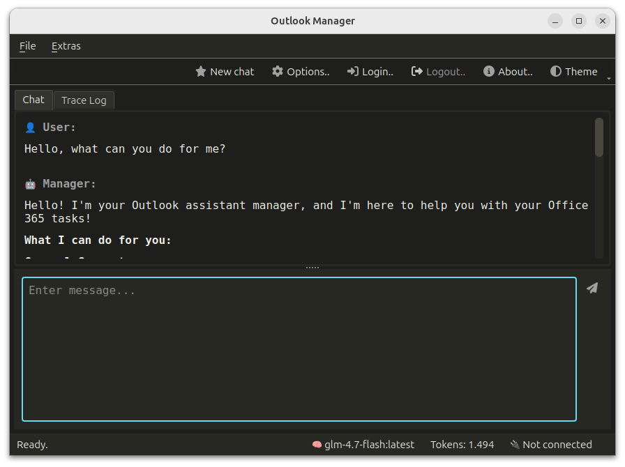

# AI Outlook-Manager 📧🤖

**Manage your Microsoft Outlook workspace through a powerful Multi-Agent System.**

The **AI Outlook-Manager** is a sophisticated desktop application that brings the power of the [OpenAI Agents SDK](https://openai.github.io/openai-agents-python/) directly to your inbox. Using the Microsoft Graph API, it allows you to interact with your emails, appointments, and tasks using natural language.



---

## ✨ Key Features

* **Multi-Agent Intelligence:** Powered by the OpenAI Agents SDK for complex task handling.
* **Flexible LLM Support:**
    * **Cloud:** Native support for OpenAI models.
    * **Local:** Full integration with **Ollama** for privacy-focused local processing.
    * **Custom:** Compatible with other OpenAI-spec APIs.
* **Safety First:** Optional **Human-in-the-loop** confirmation for all writing actions (sending emails, deleting, etc.).
* **Modern UI:** A sleek Qt-based (PySide6) chat interface.
    * 🌍 Multi-language support.
    * 🎨 4 Beautiful Color Themes to match your style.
* **Cross-Platform:** Developed for Windows and Ubuntu.

---

## 🛠 Prerequisites

* **Python:** `3.12.11`
* **Microsoft Azure Account:** You need to register an application in the [Microsoft Entra ID portal](https://entra.microsoft.com/) to get your API credentials.

---

## 🚀 Installation & Setup

1.  **Clone the repository:**
    ```bash
    git clone [https://github.com/kroll-software/AI-Outlook-Manager.git](https://github.com/kroll-software/AI-Outlook-Manager.git)
    cd AI-Outlook-Manager
    ```

2.  **Install dependencies:**
    ```bash
    pip install -r requirements.txt
    ```

3.  **Configure Environment:**
    * Rename `.env.example` to `.env`.
    * Fill in your Azure credentials:
        ```env
        CLIENT_ID=your_client_id_here
        TENANT_ID=your_tenant_id_here
        OBJECT_ID=your_object_id_here
        ```

---

## 📦 Distribution (Cross-Compilation)

The project can be compiled into a standalone executable using **Nuitka**:

```bash
python -m nuitka --standalone --enable-plugin=pyside6 --windows-console-mode=disable --output-filename=Outlook-Manager main.py
```

---

## ⚠️ Disclaimer

**Status: Beta / Experimental**

This software is in active development. AI agents can make mistakes or misinterpret commands. 
* Always review critical actions before they are executed.
* Use the "Confirmation Mode" for all writing operations.
* **Use at your own risk.** The developer is not responsible for any data loss or accidental emails sent.

---

## 📄 License

This project is licensed under the **MIT License** - see the [LICENSE](LICENSE) file for details.

---

## 👋 Contribution

Found a bug or have a feature request? Feel free to open an issue or submit a pull request! Contributions are always welcome to improve the agents' capabilities or the UI.

---

## 🙏 Acknowledgments & Credits

* **Icons:** This project uses icons from [Font Awesome](https://fontawesome.com) (Free License). 
    * License: [CC BY 4.0 License](https://creativecommons.org/licenses/by/4.0/)
* **Frameworks:** Special thanks to the teams behind [PySide6](https://www.qt.io/qt-for-python) and the [OpenAI Agents SDK](https://github.com/openai/openai-agents-python).
